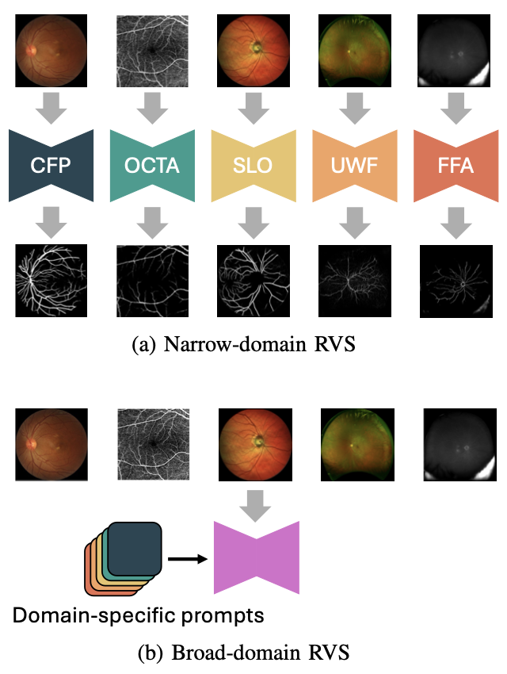

# Dual Convolutional Prompting for Broad-Domain Retinal Vessel Segmentation

Code for our ICASSP 2025 paper [Convolutional Prompting for Broad-Domain Retinal Vessel Segmentation](https://arxiv.org/abs/2412.18089)

## Abstract
Previous research on retinal vessel segmentation is targeted at a specific image domain, mostly color fundus photography (CFP). In this paper we make a brave attempt to attack a more challenging task of broad-domain retinal vessel segmentation (BD-RVS), which is to develop a unified model applicable to varied domains including CFP, SLO, UWF, OCTA and FFA. To that end, we propose Dual Convoltuional Prompting (DCP) that learns to extract domain-specific features by localized prompting along both position and channel dimensions. DCP is designed as a plug-in module that can effectively turn a R2AU-Net based vessel segmentation network to a unified model, yet without the need of modifying its network structure. For evaluation we build a broad-domain set using five public domain-specific datasets including ROSSA, FIVES, IOSTAR, PRIME-FP20 and VAMPIRE. In order to benchmark BD-RVS on the broad-domain dataset, we re-purpose a number of existing methods originally developed in other contexts, producing eight baseline methods in total. Extensive experiments show the the proposed method compares favorably against the baselines for BD-RVS.

 

## Quick start

### 1. Checkpoints

| model | Resolution | Download | Mean AP | Mean AUC |
| :--: | :--: | :--: | --: | --: |
| UNet_DCP    | 512*512   | HF | 0.6920 | 0.9736 |
| UNet_DCP    | 1024*1024 | HF |


### 2. Environment
Install packages by `pip install -r requirements.txt`. This step is suggested to be done in your docker container or virtual environment or things like that. 

### 3. Inference
Run `python inference.py`

## Model training and evaluation (TODO)


## Citation
If you find this our work useful, please consider citing:

```
@inproceedings{wei2025dcp,
  title={Convolutional Prompting for Broad-Domain Retinal Vessel Segmentation},
  author={Wei, Qijie and Yu, Weihong and Li, Xirong},
  booktitle={ICASSP},
  year={2025},
}
```

## Contact
If you encounter any issue when running the code, please feel free to reach us either by creating a new issue in the GitHub or by emailing

+ Qijie Wei (qijie.wei@ruc.edu.cn)